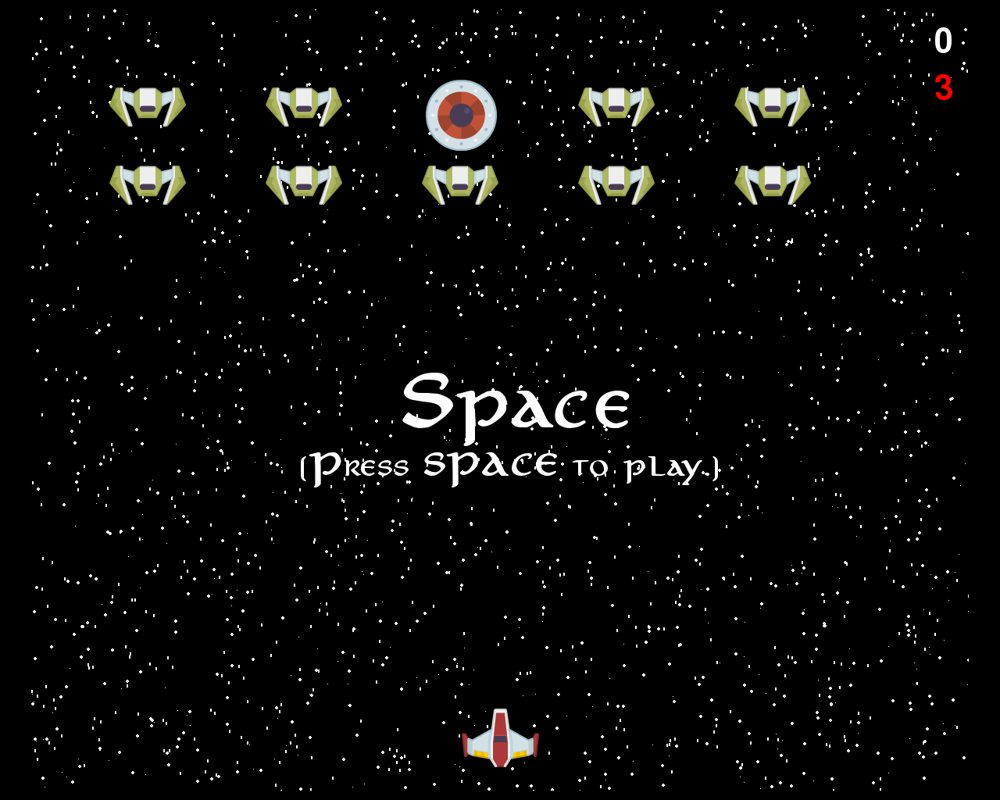

## Backstory
- You must protect your solar system from the alien invaders

- Kill all of the invaders to win

- If you fail they will easily take over our solar system

## Instructions
- press "Space" to start
- press "Esc" to quit
- use the arrow keys to move up and down and left and right
- press "Space" while playing to shoot
- press "Space" once game ends to play again

## Scoring
- Every enemy that you kill gives you 100 points

- 1000 points is the maximum amount you can get.
- The green power-up gives you shields.
- THe red power-up allows you to shoot 2 lasers at once.

## Credits
### Fonts
- Fonts from [Font](https://www.1001fonts.com/aniron-font.html)
